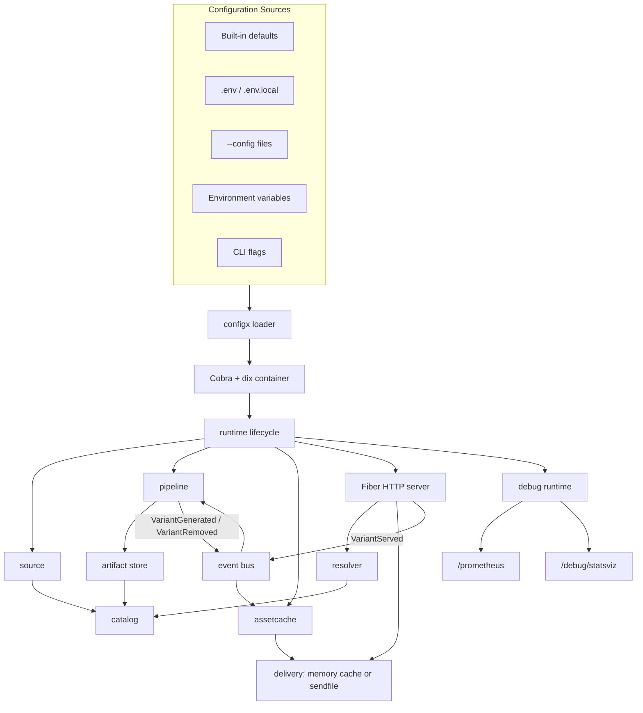

# SPACK

SPACK is a container-first static asset runtime for SPA and frontend build outputs.

It is intentionally narrower than Nginx:

- one process serves one asset mount
- configuration can be loaded from dotenv, config files, environment variables, and CLI flags
- optimized for container images and runtime base image usage
- built-in asset optimization pipeline instead of generic web server features

Current scope:

- SPA/static asset serving
- `index.html` fallback for client-side routing
- runtime asset catalog
- `gzip` and `brotli` variant generation
- on-demand image width/format variants via query or `Accept` negotiation
- in-memory hot asset cache for small files with optional startup warmup
- `sendfile` delivery for disk-backed assets and range requests
- conditional HTTP caching with `ETag`, `Last-Modified`, `Cache-Control`, `Expires`, and `304 Not Modified`
- event-driven variant lifecycle for cache warming, invalidation, and hit tracking
- lazy or warmup compression modes
- debug and metrics endpoints for container diagnostics

Out of scope:

- reverse proxy
- dynamic rewrite DSL
- TLS termination
- scripting plugins
- Nginx-style complex `location` semantics

## Architecture

The current runtime is composed of:

1. `source`
   Reads files from the configured asset backend, currently local filesystem.
2. `catalog`
   Stores scanned assets and generated variants as runtime metadata.
3. `pipeline`
   Generates compressed and image variants in lazy or warmup mode.
4. `resolver`
   Maps an HTTP request to the best asset or variant.
5. `assetcache`
   Keeps small hot responses in memory and supports warmup/invalidation.
6. `server`
   Handles HTTP, fallback, delivery, and observability.
7. `event`
   Decouples variant lifecycle notifications between server, pipeline, and cache.
8. `runtime`
   Boots scanning, warmup, HTTP serving, and debug endpoints through `dix` lifecycle hooks.



Request flow at a high level:

1. The runtime scans `SPACK_ASSETS_ROOT` into the catalog.
2. The pipeline optionally warms compressed/image variants.
3. The memory cache can optionally preload small hot assets and generated variants.
4. For each request, the resolver chooses the best asset or variant.
5. Delivery uses memory cache for eligible small files, otherwise Fiber `SendFile`.
6. Served/generated/removed variants are propagated through the event bus for decoupled cache and pipeline updates.

## Quick Start

```dockerfile
FROM daiyuang/spack:latest

COPY ./dist /app

ENV SPACK_ASSETS_ROOT=/app
ENV SPACK_ASSETS_PATH=/
ENV SPACK_ASSETS_FALLBACK_TARGET=index.html
ENV SPACK_LOGGER_LEVEL=info
ENV SPACK_COMPRESSION_ENABLE=true
ENV SPACK_COMPRESSION_MODE=lazy
ENV SPACK_IMAGE_ENABLE=true
```

Then run:

```powershell
go run .
```

Or override configuration at startup:

```powershell
go run . --config .\spack.yaml --http.port=8080 --assets.root=.\dist
```

Important endpoints:

- `/healthz`
- `/catalog`
- `/prometheus` when debug runtime is enabled
- `/debug/statsviz` on the debug runtime port

Response behavior:

- small eligible files can be served from the in-memory asset cache
- large files and range requests are delivered through Fiber `SendFile`
- static asset logs include `delivery=memory_cache_hit|memory_cache_fill|sendfile|sendfile_range`
- responses include `ETag`, `Last-Modified`, `Cache-Control`, and `Expires`
- conditional requests support `304 Not Modified`
- `HEAD` requests reuse the same header selection logic without sending a response body

## Configuration

See [`.env.example`](./.env.example) for a complete example.

Configuration sources are merged in this order:

1. built-in defaults
2. dotenv files: `.env`, `.env.local`
3. config files passed by `--config`
4. environment variables
5. CLI flags

Later sources override earlier ones.

CLI flags use config-path names directly, for example:

- `--http.port=8080`
- `--assets.root=./dist`
- `--assets.backend=local`
- `--assets.fallback.target=index.html`
- `--compression.mode=warmup`
- `--logger.level=info`

You can pass `--config` multiple times. Later files override earlier ones.

Required:

- `SPACK_ASSETS_ROOT`

HTTP:

- `SPACK_HTTP_PORT=80`
- `SPACK_HTTP_LOW_MEMORY=true`
- `SPACK_HTTP_MEMORY_CACHE_ENABLE=false`
- `SPACK_HTTP_MEMORY_CACHE_WARMUP=false`
- `SPACK_HTTP_MEMORY_CACHE_MAX_ENTRIES=1024`
- `SPACK_HTTP_MEMORY_CACHE_MAX_FILE_SIZE=65536`
- `SPACK_HTTP_MEMORY_CACHE_TTL=5m`

Assets:

- `SPACK_ASSETS_BACKEND=local`
- `SPACK_ASSETS_PATH=/`
- `SPACK_ASSETS_ENTRY=index.html`
- `SPACK_ASSETS_FALLBACK_ON=not_found|forbidden`
- `SPACK_ASSETS_FALLBACK_TARGET=index.html`

Compression:

- `SPACK_COMPRESSION_ENABLE=true`
- `SPACK_COMPRESSION_MODE=lazy|warmup|off`
- `SPACK_COMPRESSION_CACHE_DIR=<path>`
- `SPACK_COMPRESSION_MIN_SIZE=1024`
- `SPACK_COMPRESSION_WORKERS=2`
- `SPACK_COMPRESSION_QUEUE_SIZE=128`
- `SPACK_COMPRESSION_CLEANUP_EVERY=5m`
- `SPACK_COMPRESSION_MAX_AGE=168h`
- `SPACK_COMPRESSION_IMAGE_MAX_AGE=336h`
- `SPACK_COMPRESSION_ENCODING_MAX_AGE=168h`
- `SPACK_COMPRESSION_MAX_CACHE_BYTES=1073741824`
- `SPACK_COMPRESSION_BROTLI_QUALITY=5`
- `SPACK_COMPRESSION_GZIP_LEVEL=5`

Images:

- `SPACK_IMAGE_ENABLE=true`
- `SPACK_IMAGE_WIDTHS=640,1280,1920`
- `SPACK_IMAGE_JPEG_QUALITY=78`
- request width variants with `?w=<width>`
- request format variants with `?format=jpeg|png`
- format can also be negotiated from `Accept: image/jpeg,image/png`
- combine both as `?w=640&format=jpeg`

Debug and metrics:

- `SPACK_DEBUG_ENABLE=true`
- `SPACK_DEBUG_PPROF_PREFIX=/pprof`
- `SPACK_DEBUG_LIVE_PORT=8080`
- `SPACK_METRICS_PREFIX=/prometheus`
- request logs include `delivery=memory_cache_hit|memory_cache_fill|sendfile|sendfile_range` for static asset responses
- `/prometheus` includes HTTP request metrics
- `/prometheus` includes asset delivery metrics labeled by delivery mode
- `/prometheus` includes asset cache hit/miss/fill/warmup/eviction counters
- `/prometheus` includes pipeline runtime metrics such as queue length, enqueue drop/dedupe, and cleanup activity

Logger:

- `SPACK_LOGGER_LEVEL=debug`
- `SPACK_LOGGER_CONSOLE_ENABLED=true`
- `SPACK_LOGGER_FILE_ENABLED=false`
- `SPACK_LOGGER_FILE_PATH=<path>`
- `SPACK_LOGGER_FILE_MAX_SIZE=<int>`
- `SPACK_LOGGER_FILE_MAX_AGE=<int>`
- `SPACK_LOGGER_FILE_MAX_FILES=<int>`

Example startup commands:

```powershell
# use environment variables / dotenv only
go run .

# load one config file and override a few values from CLI
go run . --config .\spack.yaml --http.port=8080 --assets.root=.\dist

# layer multiple config files
go run . --config .\spack.yaml --config .\spack.local.yaml
```

## Development

Run tests:

```powershell
go test ./...
```

Use the SPA fixture:

```powershell
pnpm -C test build
$env:SPACK_ASSETS_ROOT = (Resolve-Path .\test\build\dist).Path
go run .
```

Or run the fixture with CLI flags only:

```powershell
pnpm -C test build
go run . --assets.root=./test/build/dist --assets.path=/ --assets.entry=index.html
```

## Next

The current architecture leaves room for:

- additional image formats beyond `jpeg` and `png`
- alternate source backends beyond the local asset tree
- richer cache policy strategies beyond TTL and max-size eviction
- more pipeline stages built on the same artifact/catalog/runtime model
