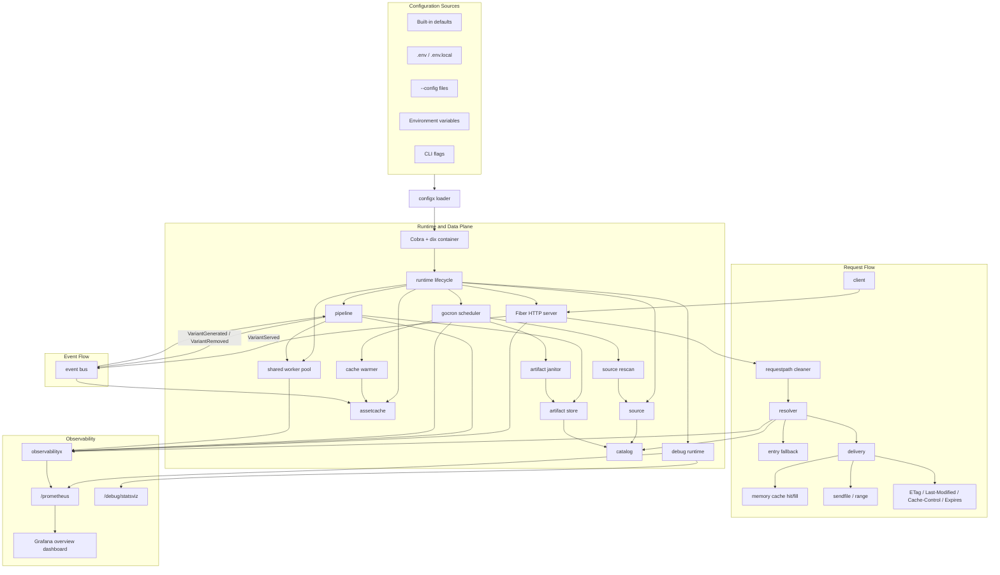

# SPACK

SPACK is a container-first static asset runtime for SPA and frontend build outputs.

It is intentionally narrower than Nginx:

- one process serves one asset mount
- configuration can be loaded from dotenv, config files, environment variables, and CLI flags
- optimized for container images and runtime base image usage
- built-in asset optimization pipeline instead of generic web server features

Current scope:

- SPA/static asset serving
- `index.html` fallback for client-side routing
- built-in `robots.txt` fallback generation with static-file precedence
- runtime asset catalog
- request-path normalization for mounted, encoded, and SPA-style routes
- `gzip`, `brotli`, and `zstd` variant generation
- on-demand image width/format variants via query or `Accept` negotiation
- in-memory hot asset cache for small files with optional startup warmup
- `sendfile` delivery for disk-backed assets and range requests
- conditional HTTP caching with `ETag`, `Last-Modified`, `Cache-Control`, `Expires`, and `304 Not Modified`
- event-driven variant lifecycle for cache warming, invalidation, and hit tracking
- lazy or warmup compression modes
- debug and metrics endpoints for container diagnostics

Out of scope:

- reverse proxy
- dynamic rewrite DSL
- TLS termination
- scripting plugins
- Nginx-style complex `location` semantics

## Architecture

The current runtime is composed of:

1. `config + dix bootstrap`
   Loads configuration from dotenv, files, env, and CLI, then wires the runtime through `dix`.
2. `source`
   Reads files from the configured asset backend, currently local filesystem.
3. `catalog`
   Stores scanned source assets and generated variants as runtime metadata.
4. `requestpath`
   Normalizes mounted paths, percent-encoded asset paths, and SPA route-like requests before resolution.
5. `resolver`
   Maps an HTTP request to the best asset or variant, including `Accept` and `Accept-Encoding` negotiation.
6. `pipeline`
   Generates compressed and image variants in lazy or warmup mode.
7. `assetcache`
   Keeps small hot responses in memory and supports warmup/invalidation.
8. `server`
   Handles HTTP, fallback, delivery, generated `robots.txt`, cache headers, and request metrics.
9. `event`
   Decouples variant lifecycle notifications between server, pipeline, and cache.
10. `task + scheduler`
    Runs internal source rescans, artifact cleanup, and cache warmup through `gocron`.
11. `runtime + observability`
    Boots HTTP/debug runtimes and exports Prometheus metrics, build/config info, and Grafana-ready signals.



Request flow at a high level:

1. The runtime scans `SPACK_ASSETS_ROOT` into the catalog.
2. An internal scheduler periodically rescans the source tree and removes stale generated artifacts.
3. The pipeline optionally warms compressed/image variants.
4. The memory cache can optionally preload small hot assets and generated variants.
5. Each request path is normalized by `requestpath` before route resolution so mounted, encoded, and SPA-style paths follow the same matching rules.
6. The resolver chooses the best asset or variant, including content-coding and image-format negotiation.
7. Delivery uses memory cache for eligible small files, otherwise Fiber `SendFile`.
8. Cache and validator headers are applied from resolved metadata and response policy rules.
9. Served/generated/removed variants are propagated through the event bus for decoupled cache and pipeline updates.

Hot paths that are intentionally optimized:

- request-path cleaning for already-canonical asset paths
- resolver negotiation for direct assets, encoding variants, and image variants
- HTTP middleware short-circuiting when request logging or metrics are disabled
- response-header calculation for `Vary`, `Content-Length`, `Last-Modified`, and cache-policy emission

## Quick Start

```dockerfile
FROM daiyuang/spack:latest

COPY ./dist /app

ENV SPACK_ASSETS_ROOT=/app
ENV SPACK_ASSETS_PATH=/
ENV SPACK_ASSETS_FALLBACK_TARGET=index.html
ENV SPACK_LOGGER_LEVEL=info
ENV SPACK_COMPRESSION_ENABLE=true
ENV SPACK_COMPRESSION_MODE=lazy
ENV SPACK_IMAGE_ENABLE=true
```

Then run:

```powershell
go run .
```

Or override configuration at startup:

```powershell
go run . --config .\spack.yaml --http.port=8080 --assets.root=.\dist
```

## Container Examples

Use SPACK directly as the runtime base image for frontend build outputs:

```dockerfile
FROM node:22-alpine AS build
WORKDIR /workspace

COPY package.json pnpm-lock.yaml ./
RUN corepack enable && pnpm install --frozen-lockfile

COPY . .
RUN pnpm build

FROM daiyuang/spack:latest

COPY --from=build /workspace/dist /app

ENV SPACK_ASSETS_ROOT=/app
ENV SPACK_ASSETS_PATH=/
ENV SPACK_ASSETS_ENTRY=index.html
ENV SPACK_ASSETS_FALLBACK_TARGET=index.html
ENV SPACK_HTTP_PORT=80
ENV SPACK_COMPRESSION_ENABLE=true
ENV SPACK_COMPRESSION_MODE=lazy
ENV SPACK_IMAGE_ENABLE=true

EXPOSE 80 8080
```

Use SPACK as a reusable runtime base in your own image family:

```dockerfile
FROM daiyuang/spack:latest AS spack-runtime

ENV SPACK_ASSETS_ROOT=/srv/www
ENV SPACK_ASSETS_PATH=/
ENV SPACK_ASSETS_ENTRY=index.html
ENV SPACK_ASSETS_FALLBACK_TARGET=index.html
ENV SPACK_HTTP_PORT=80
ENV SPACK_DEBUG_ENABLE=true
ENV SPACK_DEBUG_LIVE_PORT=8080

FROM spack-runtime
COPY ./dist /srv/www

EXPOSE 80 8080
```

Use a custom config file instead of many environment variables:

```dockerfile
FROM daiyuang/spack:latest

COPY ./dist /app
COPY ./deploy/spack.yaml /etc/spack/spack.yaml

ENV SPACK_ASSETS_ROOT=/app

CMD ["spack", "--config", "/etc/spack/spack.yaml"]
```

Use SPACK only as the runtime layer while keeping your own build pipeline:

```dockerfile
FROM daiyuang/spack:latest

COPY ./packages/web/dist /opt/assets

ENV SPACK_ASSETS_ROOT=/opt/assets
ENV SPACK_ASSETS_PATH=/assets
ENV SPACK_ASSETS_ENTRY=index.html
ENV SPACK_ASSETS_FALLBACK_TARGET=index.html
ENV SPACK_ROBOTS_ENABLE=true
```

Container deployment notes:

- keep hashed build assets cacheable and let SPACK serve `index.html` fallback separately
- expose the debug runtime port only inside trusted networks when `/prometheus` and profiling endpoints are enabled
- prefer baking assets into the image for immutable deploys instead of mounting mutable runtime volumes
- use `spack_build_info` and `spack_runtime_start_time_seconds` to correlate image versions and container restarts

Important endpoints:

- `/healthz`
- `/livez`
- `/readyz`
- `/catalog`
- `/robots.txt` when built-in robots generation is enabled
- `/prometheus` when debug runtime is enabled
- `/debug/statsviz` on the debug runtime port

Response behavior:

- small eligible files can be served from the in-memory asset cache
- large files and range requests are delivered through Fiber `SendFile`
- static asset logs include `delivery=memory_cache_hit|memory_cache_fill|sendfile|sendfile_range`
- `GET /robots.txt` serves the scanned static file when present, otherwise SPACK can generate a simple fallback from config
- responses include `ETag`, `Last-Modified`, `Cache-Control`, and `Expires`
- conditional requests support `304 Not Modified`
- `HEAD` requests reuse the same header selection logic without sending a response body

## Observability

SPACK is designed to be operated as an application runtime, not just a static file drop. The default observability surface combines:

- Prometheus runtime metrics from SPACK modules
- default Go runtime metrics such as `go_goroutines`, `go_threads`, `go_memstats_*`, `go_gc_*`, and `go_info`
- default process metrics such as `process_cpu_seconds_total`, `process_resident_memory_bytes`, `process_open_fds`, and `process_start_time_seconds`
- static runtime metadata via `spack_build_info`, `spack_config_info`, and `spack_runtime_start_time_seconds`
- scheduler telemetry through `gocron`'s `SchedulerMonitor`
- `dix` lifecycle telemetry through the `spack_dix_*` metric family

The bundled Grafana dashboard lives at [`deploy/grafana/spack-overview-dashboard.json`](C:/Users/12783/Projects/GitHub/spack/deploy/grafana/spack-overview-dashboard.json). It includes:

- application request, resolver, pipeline, cache, worker-pool, and scheduler panels
- Go runtime and process overview panels for startup time, uptime, RSS, heap, goroutines, OS threads, GOMAXPROCS, open FDs, and GC behavior
- build and runtime config tables derived from `spack_build_info` and `spack_config_info`

Recommended operational flow:

1. Import the bundled dashboard into Grafana.
2. Point it at the SPACK Prometheus target.
3. Use `spack_build_info` and `spack_runtime_start_time_seconds` to correlate deploys, restarts, and regressions.
4. Use the benchmark/profile entrypoints below before and after performance changes.

## Configuration

See [`.env.example`](./.env.example) for a complete example.

Configuration sources are merged in this order:

1. built-in defaults
2. dotenv files: `.env`, `.env.local`
3. config files passed by `--config`
4. environment variables
5. CLI flags

Later sources override earlier ones.

CLI flags use config-path names directly, for example:

- `--http.port=8080`
- `--assets.root=./dist`
- `--assets.backend=local`
- `--assets.fallback.target=index.html`
- `--robots.disallow=/admin`
- `--compression.mode=warmup`
- `--compression.encodings=br,zstd,gzip`
- `--logger.level=info`

You can pass `--config` multiple times. Later files override earlier ones.

Required:

- `SPACK_ASSETS_ROOT`

HTTP:

- `SPACK_HTTP_PORT=80`
- `SPACK_HTTP_LOW_MEMORY=true`
- `SPACK_HTTP_PREFORK=false`
- `SPACK_HTTP_MEMORY_CACHE_ENABLE=true`
- `SPACK_HTTP_MEMORY_CACHE_WARMUP=true`
- `SPACK_HTTP_MEMORY_CACHE_MAX_ENTRIES=1024`
- `SPACK_HTTP_MEMORY_CACHE_MAX_FILE_SIZE=65536`
- `SPACK_HTTP_MEMORY_CACHE_TTL=5m`

Assets:

- `SPACK_ASSETS_BACKEND=local`
- `SPACK_ASSETS_PATH=/`
- `SPACK_ASSETS_ENTRY=index.html`
- `SPACK_ASSETS_FALLBACK_ON=not_found|forbidden`
- `SPACK_ASSETS_FALLBACK_TARGET=index.html`

Async:

- `SPACK_ASYNC_WORKERS=<int>` default `runtime.NumCPU()`
- used by the shared `ants` worker pool module
- event bus async dispatch follows the same worker-count setting

Robots:

- `SPACK_ROBOTS_ENABLE=true`
- `SPACK_ROBOTS_OVERRIDE=false`
- `SPACK_ROBOTS_USER_AGENT=*`
- `SPACK_ROBOTS_ALLOW=/`
- `SPACK_ROBOTS_DISALLOW=`
- `SPACK_ROBOTS_SITEMAP=`
- `SPACK_ROBOTS_HOST=`
- when `SPACK_ROBOTS_OVERRIDE=false`, a scanned `robots.txt` asset is served as-is if present
- when no scanned `robots.txt` exists, SPACK generates a simple fallback response from the robots config

Compression:

- `SPACK_COMPRESSION_ENABLE=true`
- `SPACK_COMPRESSION_MODE=lazy|warmup|off`
- `SPACK_COMPRESSION_CACHE_DIR=<path>`
- `SPACK_COMPRESSION_MIN_SIZE=1024`
- `SPACK_COMPRESSION_WORKERS=2`
- `SPACK_COMPRESSION_QUEUE_SIZE=128`
- `SPACK_COMPRESSION_ENCODINGS=br,zstd,gzip`
- `SPACK_COMPRESSION_CLEANUP_EVERY=5m`
- `SPACK_COMPRESSION_MAX_AGE=168h`
- `SPACK_COMPRESSION_IMAGE_MAX_AGE=336h`
- `SPACK_COMPRESSION_ENCODING_MAX_AGE=168h`
- `SPACK_COMPRESSION_MAX_CACHE_BYTES=1073741824`
- `SPACK_COMPRESSION_BROTLI_QUALITY=5`
- `SPACK_COMPRESSION_ZSTD_LEVEL=3`
- `SPACK_COMPRESSION_GZIP_LEVEL=5`

Images:

- `SPACK_IMAGE_ENABLE=true`
- `SPACK_IMAGE_WIDTHS=640,1280,1920`
- `SPACK_IMAGE_FORMATS=jpeg,png`
- `SPACK_IMAGE_JPEG_QUALITY=78`
- request width variants with `?w=<width>`
- image processing uses the builtin Go image pipeline and supports `jpeg` and `png`
- request format variants with `?format=jpeg|png`
- format can also be negotiated from `Accept: image/jpeg,image/png`
- combine both as `?w=640&format=jpeg`
- when `SPACK_IMAGE_FORMATS` is set, warmup/default image planning can pre-generate those formats
- when `SPACK_IMAGE_FORMATS` is empty, request-time `Accept` negotiation can still ask for any supported output format

Debug and metrics:

- `SPACK_DEBUG_ENABLE=true`
- `SPACK_DEBUG_PPROF_PREFIX=/pprof`
- `SPACK_DEBUG_LIVE_PORT=8080`
- `SPACK_METRICS_PREFIX=/prometheus`
- request logs include `delivery=memory_cache_hit|memory_cache_fill|sendfile|sendfile_range` for static asset responses
- `/prometheus` includes HTTP request metrics
- `/prometheus` includes HTTP runtime gauges such as `spack_http_requests_in_flight`
- `/prometheus` includes asset delivery metrics labeled by delivery mode
- `/prometheus` includes health runtime metrics such as `spack_health_check_runs_total`, `spack_health_check_duration_seconds`, `spack_health_reports_total`, and `spack_health_report_duration_seconds`
- `/prometheus` includes asset cache hit/miss/fill/warmup/eviction counters
- `/prometheus` includes pipeline runtime metrics such as queue length, enqueue drop/dedupe, and cleanup activity
- `/prometheus` includes pipeline stage execution metrics such as `spack_pipeline_stage_runs_total`, `spack_pipeline_stage_duration_seconds`, `spack_pipeline_variants_generated_total`, and `spack_pipeline_variants_generated_bytes_total`
- `/prometheus` includes catalog gauges such as `spack_catalog_assets_current`, `spack_catalog_variants_current`, and `spack_catalog_source_bytes_current`
- `/prometheus` includes resolver metrics such as `spack_resolver_resolutions_total`, `spack_resolver_resolution_duration_seconds`, and `spack_resolver_generation_requests_total`
- `/prometheus` includes background task metrics such as `spack_task_runs_total`, `spack_task_run_duration_seconds`, `spack_source_rescan_*`, `spack_artifact_janitor_*`, and `spack_cache_warmer_*`
- `/prometheus` includes scheduler runtime metrics such as `spack_task_scheduler_running`, `spack_task_scheduler_events_total`, `spack_task_scheduler_job_events_total`, `spack_task_scheduler_job_execution_seconds`, `spack_task_scheduler_job_scheduling_delay_seconds`, `spack_task_scheduler_concurrency_limit_total`, `spack_task_scheduler_jobs_registered_current`, and `spack_task_scheduler_jobs_running_current`
- `/prometheus` includes worker pool gauges such as `spack_workerpool_capacity_current`, `spack_workerpool_running_current`, `spack_workerpool_waiting_current`, and `spack_workerpool_free_current`
- `/prometheus` includes worker pool execution metrics such as `spack_workerpool_batch_runs_total`, `spack_workerpool_batch_duration_seconds`, `spack_workerpool_task_runs_total`, `spack_workerpool_task_duration_seconds`, and `spack_workerpool_task_submissions_total`
- `/prometheus` includes `dix` runtime lifecycle metrics with the `spack_dix_*` prefix
- `spack_dix_*` covers app build/start/stop, health checks, and state transitions
- representative metrics include `spack_dix_build_total`, `spack_dix_start_total`, `spack_dix_health_check_total`, and `spack_dix_state_transition_total`
- `/prometheus` includes static runtime metadata gauges such as `spack_build_info`, `spack_config_info`, and `spack_runtime_start_time_seconds`
- `spack_build_info` exposes low-cardinality build labels such as app version, Go version, and VCS revision
- `spack_config_info` exposes low-cardinality runtime mode labels such as asset backend, compression mode, memory-cache state, and logger level
- `spack_runtime_start_time_seconds` exposes the current process start timestamp for restart and uptime correlation

Logger:

- `SPACK_LOGGER_LEVEL=debug`
- `SPACK_LOGGER_CONSOLE_ENABLED=true`
- `SPACK_LOGGER_FILE_ENABLED=false`
- `SPACK_LOGGER_FILE_PATH=<path>`
- `SPACK_LOGGER_FILE_MAX_SIZE=<int>`
- `SPACK_LOGGER_FILE_MAX_AGE=<int>`
- `SPACK_LOGGER_FILE_MAX_FILES=<int>`

Internal scheduled tasks:

- SPACK runs an internal source rescan every 5 minutes
- the rescan reconciles mounted source files with the in-memory catalog
- removed or changed source assets cause stale generated variants and cache entries to be invalidated
- the internal scheduler is instrumented through `gocron`'s `SchedulerMonitor` interface and exports per-job registration, run, failure, execution-time, scheduling-delay, and concurrency-limit metrics
- this scheduler is internal runtime behavior and is not exposed as user configuration

Example startup commands:

```powershell
# use environment variables / dotenv only
go run .

# load one config file and override a few values from CLI
go run . --config .\spack.yaml --http.port=8080 --assets.root=.\dist

# layer multiple config files
go run . --config .\spack.yaml --config .\spack.local.yaml
```

## Development

Run tests:

```powershell
go test ./...
```

Run repeatable performance baselines:

```powershell
task perf:bench
```

Capture CPU and memory profiles for a single subsystem:

```powershell
task perf:profile:resolver
task perf:profile:cache
task perf:profile:pipeline
task perf:profile:http
go tool pprof .\tmp\perf\resolver.cpu.pprof
```

The current baseline focuses on four hot paths:

- `resolver.Resolve` for direct asset, encoding variant, and image variant selection
- `assetcache.GetOrLoad` for cache hit and miss behavior
- `pipeline.Service.Enqueue` for unique and deduplicated lazy-generation requests
- HTTP asset delivery through memory-cache-hit and sendfile paths

Recent optimization work has primarily targeted:

- request-path normalization
- resolver variant negotiation and per-request reuse
- HTTP middleware short-circuiting and response-header emission

Profile artifacts are written to `tmp/perf/` so later optimization passes can compare against the same entrypoints.

Use the SPA fixture:

```powershell
pnpm -C test build
$env:SPACK_ASSETS_ROOT = (Resolve-Path .\test\build\dist).Path
go run .
```

Or run the fixture with CLI flags only:

```powershell
pnpm -C test build
go run . --assets.root=./test/build/dist --assets.path=/ --assets.entry=index.html
```

## Next

The current architecture leaves room for:

- alternate source backends beyond the local asset tree
- richer cache policy strategies beyond TTL and max-size eviction
- more pipeline stages built on the same artifact/catalog/runtime model
